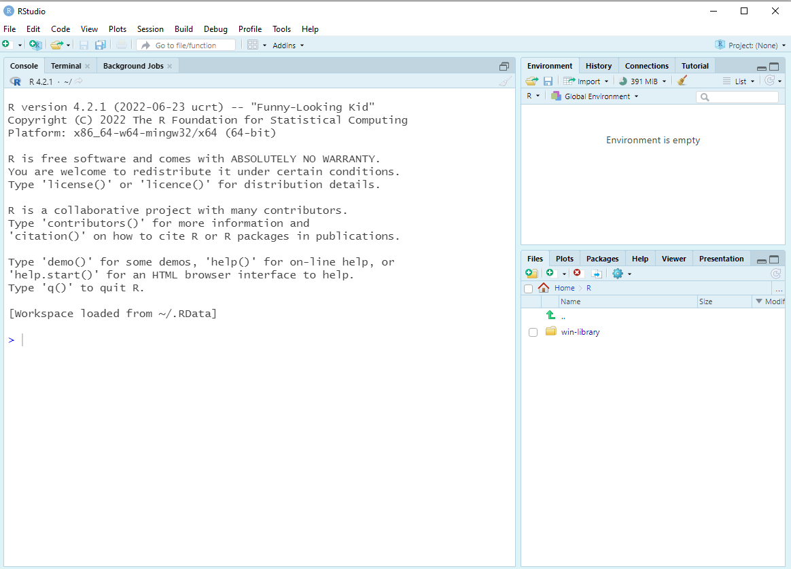
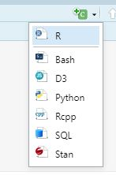
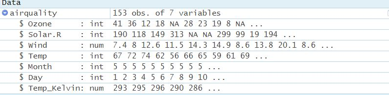
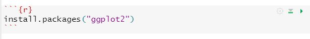
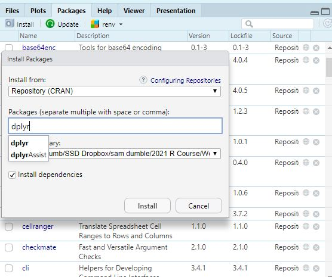
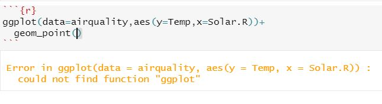
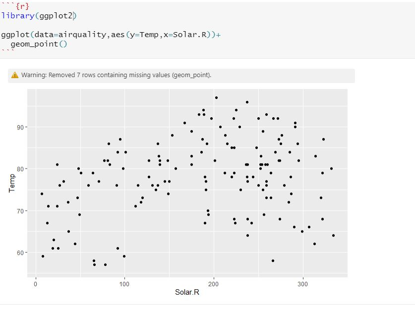

```{r setup, include=FALSE}
library(learnr)
library(tidyverse)
tutorial_options(exercise.timelimit = 10)
```

## Overview

In this session, we will guide you through the process of setting up R and RStudio on your computer, and introduce you some useful tips and good practice for using RStudio.

The main topics we will cover:

-   Installing R and RStudio

-   What is RStudio?

-   Overview of RStudio layout and menus

-   Using the markdown file format to write script files

-   Installing packages

-   Using project files

-   Importing data

-   Exporting results

This module is a little different to the previous three modules - there won't be any interactive code windows to fill in this workbook - instead there will be instructions and screenshots that you should try to replicate on your own computer.

The video for this module gives you a brief tour of these features:


## Installing R and RStudio

Both R and RStudio are open source software tools, and these can be downloaded for free. Versions are compatible with nearly all operating systems.

Even if you have prior installations of R or RStudio on your computer - please ensure you download and install the most recent versions of both programs. R and RStudio are both under constant active development and updated on a regular basis. Some of the RStudio features we talk about, or functions we cover, in this course may not be available if you are using an older version of R or RStudio.

The first thing to install is the most recent version of R for your operating system: <a href="https://cran.r-project.org/bin/windows/base/" target="_blank">Download R for Windows</a>

<a href="https://cran.r-project.org/bin/macosx/" target="_blank">Download R for Mac</a>

Once you have completed the installation of R you can download RStudio, the link below should provide the recommended link to download based on your operating system. <a href="https://posit.co/download/rstudio-desktop/#download" target="_blank">Download RStudio</a>

You should not need to change any of the default settings as you work through the installation process. If you are having any issues with the downloading and installation process please make sure that you have administrator rights on the computer you are working on.

If you are struggling to complete the installation process then please ask in the technical support or help forums for these modules.

## What is RStudio?

Before getting into RStudio - it is worth taking a quick step back to understand what exactly "R" itself is. Usually when we talk about R we mean the language itself - but when you downloaded and installed this you may have seen that R is a standalone program in itself that you could use. Very occasionally when you look up resources online you will see people using R without using RStudio. If you search in your program files you should find it:

```{r echo=FALSE, out.width="10%", fig.align='left'}
knitr::include_graphics("images/rlogo.jpg")
```

Opening R you see a very old fashioned, and quite intimidating interface! There are very few features within the R GUI to help you get started, or to optimise your workflow at all.

You can see a console window in which you can run write and run commands. So I could try and see if 2+2 still equals 4:

```{r echo=FALSE, out.width="90%", fig.align='center'}
knitr::include_graphics("images/Rinterface.JPG")
```

And I can see that R is at least functioning correctly as a calculator.

The general user un-friendliness is what led to the development of IDEs (Interactive Development Environment) for R, to help make working with R easier. RStudio was not the first of these, but over time it has developed to become by far the dominant tool used by those working with R (the language) on a regular basis. In a 2021 survey 83% of R users indicated they use RStudio as the way in which they interacted with R (<https://www.jetbrains.com/lp/devecosystem-2021/r/>). Looking into the methodology, and given the skew in that sample towards software developers rather than researchers, I would actually suspect that to be an underestimate!

You can now close down the "R" window.

## Overview of RStudio Layout

First let's open up RStudio. It should look something like this:

```{r echo=FALSE, out.width="90%", fig.align='center'}

```

Here you will see three main "panes" initally.

-   Left hand side: This is the console window, by default this is where you can type in commands, run code and where output would be displayed. You will notice this part looks extremely similar to what you saw when you opened up "R" the standalone software application earlier. Effectively this is exactly the same thing - and now everything else covered from this point on will be specific to only RStudio.
-   Top right - by default this shows the "environment" pane. This is where all of your stored objects will be listed. You can also see a history of your recently submitted commands, a list of open connections to external data sources, and some built in tutorials that could help you on specific topics.
-   Bottom right - this is also a multi-purpose pane where by default it links to the file manager so you can open and view files within R. If you create plots then these will appear in the Plots tab; although interactive plots or other interactive output will appear in the Viewer tab and if you create any powerpoint style presentations these will appear in the Presentation tab. The Packages tab shows a list of the currently installed packages, and allows you to install new packages or update existing packages. You can also see a point-and-click access to the help menus. This is another way to access the same help menus we mentioned in module 1 which can appear by typing `?functionname` into the console.

It is possible to totally re-organise the layourt of these panes if you want - but for now I will assume you are happy with these default layouts.

Rather than starting straight from from scratch right now, let's work with a pre-existing set of file which should hopefully look familiar - the solutions from Module 1 of this course. These can be downloaded <a href="https://raw.githubusercontent.com/stats4sd/RCourse_2023_download_files/dev/Module%201%20Solutions.Rmd" download>from this link. Right click and select "Save Link As" to download to a sensible folder on your computer </a>

Open the file "Module 1 Solutions.RMD" in RStudio, using the menu system within RStudio by selecting File (in the top left corner) and then Open File.

Once opened, your window should look something like this

```{r echo=FALSE, out.width="90%", fig.align='center'}
knitr::include_graphics("images/Window.JPG")
```

Now you will see four panes - and this is usually what you will have when working with R Studio. The console has dropped to the bottom left and the scripting window has appeared in the top left.

One of the first things I would generally suggest doing is minimising the console window. We never want to write commands in the console window directly - as these are just temporary. Always use some form of a script file so that you can keep a track of all of the commands you are writing. It's important in research to make sure our work is reproducible - and using a script allows us to easily identify and fix errors can be easily, build upon existing analysis, or run the same analysis again using different data. Let's look at this now in more detail.

## R Markdown Files

Now let's take a look at the script file you have opened. The format being using in this course is a .RMD (R Markdown) file. Within this format you can write notes and have interactive code chunks, with in-line output like you have been seeing with the online tutorials. Pressing the green 'play' button to the right of the chunk of code will run the code. The output will then appear directly below the code within the RMD document.

```{r echo=FALSE, out.width="70%", fig.align='center'}
knitr::include_graphics("images/RunningCode.JPG")
```

Make good use of the spaces between the chunks of code - you can write whatever you like in these spaces outside of the code chunks! This is extremely useful for you to add comments as you work through your analysis - explaining the logic behind particular steps, or reminding yourself of key pieces of information.

You can add in new R chunks anywhere in the markdown file - the easiest way to do this is to select the green "C" button in the top right corner of the script file and then select "R"

```{r echo=FALSE, out.width="70%", out.width="30%", fig.align='center'}

```

*Exercise: Work your way through the solutions file and run all of the chunks of code. Notice that some of them will produce errors, and you will see how these errors and warnings are handled in the markdown file as you proceed.*

When working on your own analyses there are a few important things to remember about creating script files:

1.  Work sequentially! Make sure data is loaded at the beginning and be sure to put any data manipulation steps in before moving into analysis, otherwise you may end up with changes not being applied corrects.

2.  Unless you are sharing your file with someone else to try to resolve an error, don't include all of your 'failed' attempts at writing code within the script file - only keep the code that works. We would like to have clear organisation of our commands, and not have things included that don't work.

3.  Use the areas around the code chunks to write explanations and comments about what you are doing, and why you are doing it. Particularly if you have come across something new or exciting. Or (following from pt 2) if you get stuck- you can write the commands that are not working outside of code chunks and include notes about your problems. The code you are writing may make perfect sense to you right now - but when you come back next week, or next month... or next year, it might not make so much sense then.

4.  Be careful about breaking the formatting style of the code chunks, by accidentally modifying or deleting the way they appear. It is safer to use the "Insert-\>R" button from the top right to add in chunks rather than try to write these out, or copy them.

When you have worked down to the bottom of the solutions you will have reached the examples where objects were created to solve problems. So you should have seen things start to appear in the 'environment' pane, which will show you all of the user created objects produced in this R session.

```{r echo=FALSE, out.width="70%", fig.align='center'}
knitr::include_graphics("images/objects in environment.JPG")
```

There are two kinds of object produced in this session - 'data' and 'values'. Notice that there is a blue button next to the `airquality` data. Clicking on the blue button will show you the column names, the class of each of the columns (integer, numeric, character) and the first few entries in each column.

```{r echo=FALSE, out.width="70%", fig.align='center'}

```

Clicking on the name of the dataset will open up a spreadsheet view that will let you explore the data - similar to how you could in excel. Although note that the data cannot be edited through this spreadsheet view.

```{r echo=FALSE, out.width="70%", fig.align='center'}
knitr::include_graphics("images/viewer.JPG")
```

There are two other formats of script file it is also worth being aware of:

The .R (R Script) format, which is a older and contains only commands - the output is not shown in line for the .R file, instead it goes to the console. containing the solutions you can see two distinct types of content on the page.

The .QMD (Quarto) format, which is very similar to the .RMD format on the surface but is much newer. The main difference is that this format has better cross-language compatibility, if for example you start wanting to use Python and R in the same analysis, or more generally just use the same setup for coding in Python as you use for coding in R. Longer term this format may start to get more usage - but as of 2022 it is still new and not widely adopted, so we would recommend using the .RMD format as it is likely you will find it easier to get support for this in case of problems and in this course at least, we are only focused on running R code.

## Installing Packages

In modules 2 and 3 we used the packages `ggplot2` and `dplyr` for graphics and data manipulation. These are additional libraries, not included with the 'base' installation of R. If you are using R and RStudio for the first time these packages will not be available to you.

There are two main ways of installing packages - let's look at one for `ggplot2` and another option for `dplyr`

Option 1: Write a command

Create a new R chunk within the existing .RMD file and write the command `install.packages`. The argument needed for this function is simply the name of the package you wish to install and then the package name in quotation marks.

```{r echo=FALSE, out.width="70%", fig.align='center'}

```

Then running this command will download the package and install it on your computer.

Check the final message which appears. If you see something which ends with 'success' then the package has installed correctly! If you see an error message after trying to install a package then you have run into an issue. Don't be afraid to ask for help if you come across issues in this process for package installation at first, as there can sometimes be firewall, or other compatibility issues, which can be resolved with a bit of technical support.

The alternative option is to navigate to the packages tab in the bottom right pane and then click on the 'install' button. This will open a new menu where you can specify which packages you want to install. Let's use this method to install dplyr

```{r echo=FALSE, out.width="70%", fig.align='center'}

```

Just because we have installed our packages does not mean we can use them though! Maybe I want to apply what I learnt in Module 2 and make a scatter plot from the airquality data set.

```{r echo=FALSE, out.width="70%", fig.align='center'}

```

Did I make a mistake in the code? Actually - no. Look at the error message; "could not find function ggplot".

When you see this error it usually means one of two things: either you have made a spelling error or, like now, you have not loaded the library in which the function you are trying to use is stored. In this case I need to make sure I load the ggplot2 library so that I can have access to the ggplot command.

We need to load any additional packages we have downloaded within our R session using the `library` command within every R session in which we plan on using it. But we only need to download and install the packages one time.

So let's try my code again - but this time running `library(ggplot2`) directly before:

```{r echo=FALSE, out.width="70%", fig.align='center'}

```

It's usually good practice to load all libraries you use in a script file in a setup chunk as the very first thing you include in your R script.

Once you have finished it is usually a good idea to save your script file - in a sensible folder with a sensible file name. Since you downloaded the module 1 solutions and then opened the file that had already been created if you were to save the file now, it would over-write the version you had previously downloaded. So it is probably a good idea to use Save-As and then create a new copy. Files can quickly start to build up when using RStudio - it is good to try to be organised and this is where project files can come in.

## Working with projects

Once you have saved any changes let's now move to a completely different task - thinking now about the solutions to Module 2. You can download a zip file containing the solutions for Module 2 in RMD format, and the data file used, in CSV format [here](https://github.com/stats4sd/RCourse_2023_download_files/raw/dev/Module-2-Solutions.zip)

First of all - we should start by extracting the contents of that zip file into a sensible folder somewhere on your computer.

Then we can create a new project in RStudio (File-\>New Project) and setting this to an "Existing Directory" - the folder where you just extracted these files to. Since we have already got these files downloaded and organised we can set it to an existing directory, if we are starting truly from scratch then we would set it to a completely new folder. Preferably keep the name of this project as something simple.

As explained in the video, projects are a really useful way of keeping your work organised, and making it easy to link to input data files and store output files in a coherent workflow. They save the hassle of having to constantly working with overly long file paths and changing your working directory.

In the files pane in the bottom right, you should now see that this has navigated to the folder you just assigned the project to. It will also create a new .RProj file, which is the R project file. If you go away from RStudio, and come back another time you can reload your session exactly where you left it by opening this .RProj file. Opening this file will also automatically set your working directory to the folder in which the project is contained. The project file automatically saves as you work - once it is set up you almost don't even need to think about it again until you find yourself with a different project to work on! There is also a project menu in the top right corner which will let you switch between recently used projects, or create new projects. When working through the later modules of this course we would very strongly recommend that you set up project files to complete the exercises - this will make following the code much easier as you will be able to locate and import datasets much more easily.

Project files are especially useful for when working in collaborative projects or when switching between machines so that you can keep any file path references consistent and not have to potentially change them. Writing import statements to specific file locations can quickly turn into horribly long lines of code - and they will only ever be specific to your computer so would have to be amended by anyone else you shared the code with.

As the file pane should now be showing you the folder where you extracted the module 2 solutions, you should be able to open it by just clicking on it.

If you have set the project file, and installed ggplot you should now be able to go through the solutions file and run each of the chunks of code to see the 'solved' answers.

Make sure you work through the code for Module 2 sequentially. Loading the packages and the data first, otherwise the later steps will not run.

## Importing Data

You can see from the first chunk of the Module 2 solutions that we now introduce a new function `read.csv` being used to read the data file in. As long as you set up your project correctly, this line will read in the datafile and store it in R as an object called Pulse. When you run this line you should see it appear in your environment pane. Importing clean data saved in CSV format is easy!

The next workbook for this module will cover what you need to do if you find yourself needing to import data from other sources, or that may not be so clean. A key point to understand is that the cleanliness and complexity of the structure of your data outside of R will effect how easy the data is to read in.

## Exporting Results

One of the great things about using R markdown files and R project files, is how easy it is to export results outside of R. If you have followed the advice in this module and installed all required packages then you should be able to easily convert the output from the Module 2 solutions into a beautiful report, in your choice of format (PDF/Word/HTML) by simply pressing the knit button at the top of the window and selecting the output format. This will initially ask you to install a few more packages, and you will always be prompted to save your document, if there are unsaved changes, before any output is made.

```{r echo=FALSE, out.width="40%", fig.align='left'}
knitr::include_graphics("images/knit.JPG")
```

Try it now using either of the module 2 solutions RMD file.

There are a lot of ways to improve on the default appearance of your output, but going in detail to this is a little beyond the scope the course. If you are interested in learning more, see the markdown cheat sheet for more information <a href="https://www.rstudio.com/wp-content/uploads/2015/02/rmarkdown-cheatsheet.pdf" target="_blank"> here </a>

## Appendix: Useful reference links

RStudio website:<a href="https://rstudio.com/" target="_blank">https://rstudio.com/ </a>

R-project website:<a href="https://www.r-project.org/" target="_blank">https://www.r-project.org/ </a>

Andy Field's Getting started in R and RStudio:<a href="http://milton-the-cat.rocks/learnr/r/r_getting_started" target="_blank">http://milton-the-cat.rocks/learnr/r/r_getting_started </a>

R Markdown documentation:<a href="https://rmarkdown.rstudio.com/lesson-1.html" target="_blank">https://rmarkdown.rstudio.com/lesson-1.html </a>

RStudio CheatSheet:<a href="https://ucdavis-bioinformatics-training.github.io/Oct2017-ILRI-Workshop/Cheat_Sheets/rstudio-IDE-cheatsheet.pdf" target="_blank">https://ucdavis-bioinformatics-training.github.io/Oct2017-ILRI-Workshop/Cheat_Sheets/rstudio-IDE-cheatsheet.pdf </a>

R Markdown CheatSheet:<a href="https://rstudio.com/wp-content/uploads/2015/02/rmarkdown-cheatsheet.pdf" target="_blank">https://rstudio.com/wp-content/uploads/2015/02/rmarkdown-cheatsheet.pdf </a>
