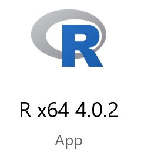
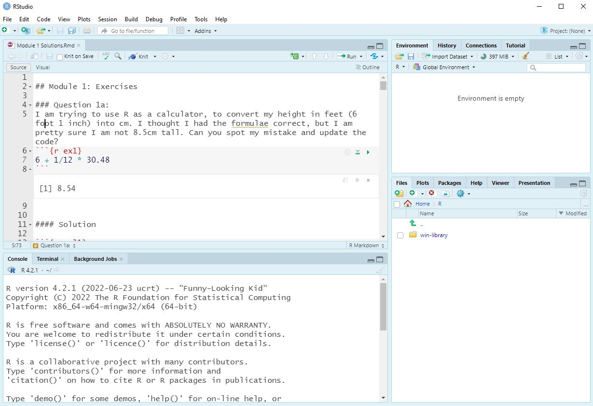
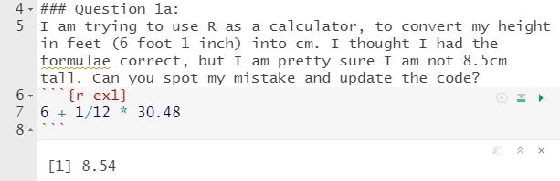
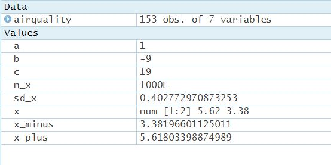
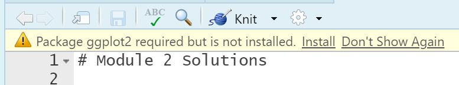
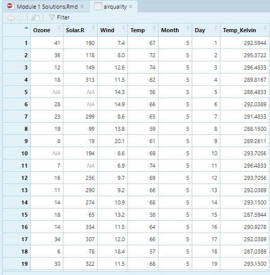

```{r setup, include=FALSE}
library(learnr)
library(tidyverse)

tutorial_options(exercise.timelimit = 10)
```


## Overview

In this session, we will guide you through the process of setting up R and RStudio on your computer, and start familiarising yourself with good practice for using RStudio. We will cover installing packages, using projects, and writing scripts using the markdown format. Now that you have learnt some R code already in the first three sessions, hopefully it will become a little bit clearer how you can then interact with RStudio for your own work, and how and why these features are useful. 

This module is a little different to the previous three modules - there won't be any interactive code windows in this workbook. Instead you will be working through this workbook to provide steps which cover the installation and orientation of R and RStudio on your own machine.

There are a series of great video resources going along with this session... but we didn't produce these ourselves. Rather than reinventing the wheel here, we are referring to a series of videos by the statistician Andy Field. The full resource he put together for getting started with RStudio can be found <a href="http://milton-the-cat.rocks/learnr/r/r_getting_started" target="_blank">here.</a>


## Installing R and RStudio

Both R and RStudio are open source software tools, so these can be downloaded from the internet for free, forever. 

Even if you have prior installations of R or RStudio on your computer - please ensure you download and install the most recent versions of both programs. R and RStudio are both updated on a very regular basis, and some of the features we may highlight in this course may not be available if you are using an older version. 

<a href="http://milton-the-cat.rocks/learnr/r/r_getting_started/#section-installing-r-and-rstudio" target="_blank">Video covering the installation process</a>

The first thing to install is the most recent version of R for your operating system:
<a href="https://cran.r-project.org/bin/windows/base/" target="_blank">Download R for Windows</a>

<a href="https://cran.r-project.org/bin/macosx/" target="_blank">Download R for Mac</a>

Once you have completed the installation of R you can download RStudio, the link below should provide the recommended link to download based on your operating system.
<a href="https://rstudio.com/products/rstudio/download/#download" target="_blank">Download RStudio</a>

You should not need to change any of the default settings as you work through the installation process. If you are having any issues with the downloading and installation process please make sure that you have administrator rights on the computer you are working on. Please remember that you can use the help forum at any time if you are struggling with these steps.

## Overview of R

It is worth remembering that R is a standalone program that you could use; and very occasionally when you look up resources online you will see people using R without using RStudio. This is something that you will never need to do. But it might be useful to open up R now to see how things used to be for R users, before RStudio came along.
If you search in your program files you should find it:

```{r echo=FALSE, out.width="10%", fig.align='left'}

```


Opening R you see a very old fashioned, and quite intimidating interface! There are very few features within the R GUI to help you get started, or optimise your workflow at all.

You can see a console window in which you can run write and run commands. So I could try and see if 2+2 still equals 4:

```{r echo=FALSE, out.width="90%", fig.align='center'}
knitr::include_graphics("images/Rinterface.JPG")
```


And I can see that R is at least functioning correctly.

The general user un-friendliness is what led to many people making IDE (Interactive Development Environment) tools, to make working with R easier. RStudio was not the first of these, but over time it has become the only method for working with R for the majority of R users. 

You can now close down R and head straight over to RStudio.

## Overview of RStudio

Andy Field's video gives you an overview of RStudio that should help you orientate yourself as a new user to the purpose of each of the different panes within the RStudio environment.

<a href="http://milton-the-cat.rocks/learnr/r/r_getting_started/#section-a-quick-tour-of-r-studio" target="_blank">A quick tour of R Studio</a>

I'd suggest watching this back-to-back with the next video in the sequence, which starts moving into more specifics about how you can get started with some work!

<a href="http://milton-the-cat.rocks/learnr/r/r_getting_started/#section-working-in-rstudio" target="_blank">Working in RStudio</a>


Rather than creating a new file from scratch right now, you can download the solutions from Module 1 as a workbook [here](https://github.com/stats4sd/r2020_04Rstudio/raw/main/Module-1-Solutions.zip). 

And if you then open this up in RStudio (Using the menu system: File->Open File) you can get an idea of how the interface works. 


Once opened, your window should look something like this

```{r echo=FALSE, out.width="90%", fig.align='center'}

```


One of the first things I would suggest doing is minimising the console window. We never want to write commands in the console window directly - always use some form of a script file so that you can keep a track of all of the commands you are writing. It's important to make sure our work is reproducible, that errors can be easily identified and fixed, and that we can easily update and build upon what we have done so far.

If you look at the RMD (R Markdown) file containing the solutions you can see two distinct types of content on the page. You have text - where you can write whatever you like. And you have 'chunks' of R code, where you can only write valid R code.

Pressing the green button to the right of the chunk of code will run the code. The output will then appear directly below the code within the RMD document.

```{r echo=FALSE, out.width="70%", fig.align='center'}

```


Make good use of the spaces between the chunks of code! This is extremely useful for you to add comments as you work through your analysis - explaining the logic behind particular steps, or reminding yourself of key pieces of information.

When you work down to the bottom of the solutions you will reach the examples where objects were created to solve problems. As you run these lines you will see things start to appear in the environment window, showing you all of the user created objects produced in this R session.

```{r echo=FALSE, out.width="70%", fig.align='center'}

```


## Working with projects

You can download the solutions for Module 2 in RMD format, and the data file used, in CSV format [here](https://github.com/stats4sd/r2020_04Rstudio/raw/main/Module-2-Solutions.zip)

This is a good opportunity to learn about working with project files, importing data, and installing and loading packages.

First of all - we should start by extracting the contents of that zip file into a sensible folder somewhere on your computer. 

Then we can create a new project in RStudio (File->New Project) and setting this to an "Existing Folder" - the folder where you just extracted these files to. As explained in the video, projects are a really useful way of keeping your work organised, and making it easy to link to input data files and store output files in a coherent workflow.

In the files pane, you should now see that this has navigated to the folder you just assigned the project to. It will also create a new .RProj file, which is the R project file. If you go away from RStudio, and come back another time you can reload your session exactly where you left it by opening this .RProj file. The project file automatically saves as you work. There is also a project menu in the top right corner which will let you switch between recently used projects, or create new projects.

As the file pane should now be showing you the folder where you extracted the module 2 solutions, you should be able to open it by just clicking on it.

## Installing Packages

When you do this you will probably see a prompt at the top of the RMD window telling you that the ggplot2 package is used in this script, but has not been installed. 

```{r echo=FALSE, out.width="70%", fig.align='center'}

```


You will see this message when your file contains a call to `library()` but the package inside that function is not installed. 

To install ggplot2 you can then click on the install button at the top of your page and this will then connect to the CRAN repository to download it. Check the final message which appears. If you see something which ends with 'success' then the package has installed correctly! If you see an error message after trying to install a package then you have run into an issue. Don't be afraid to ask for help if you come across issues in this process for package installation at first, as there can sometimes be firewall, or other compatibility issues, which can be resolved with a bit of technical support.

You can watch the video about installing and loading packages here:
<a href="http://milton-the-cat.rocks/learnr/r/r_getting_started/#section-installing-and-loading-packages" target="_blank">Installing and loading packages</a>

## Markdown Files

The video introduction for writing R scripts can be found here:
<a href="http://milton-the-cat.rocks/learnr/r/r_getting_started/#section-r-markdown" target="_blank">R Markdown</a>

If you have set the project file, and installed ggplot you should now be able to go through the solutions file and run each of the chunks of code to see the 'solved' answers.
Make sure you work through sequentially. Loading the packages and the data first, otherwise the later steps will not run. You can see from the first chunk a new function `read.csv` being used to read the data file in. We will learn more about reading in data in the second part of this module, but for now you can trust that, as long as you set up your project correctly, this line will read in the datafile and store it in R as an object called Pulse. When you run this line you should see it appear in your environment pane.


And if you click on it within that environment pane, it will open a (non-editable) spreadsheet like interface to view the data.

```{r echo=FALSE, out.width="70%", fig.align='center'}

```


When writing your own markdown files there are a few key points to remember:

1. Work sequentially! Always start by loading libraries and data; and put data manipulation steps before moving into analysis.

2. Unless you are sharing with someone else to try to resolve an error, don't keep any code that you couldn't get to work within the document. We would like to have clear organisation of our commands, and not have things included that don't work. But remember for those things...

3. Use the areas around the code chunks to write explanations and comments about what you are doing, and why you are doing it. Particularly if you have come across something new or exciting. Or (following from pt 2) if you get stuck- you can write comments about your problems when sharing. Your code may make perfect sense to you now - but when you come back next week, or next month... or next year, it might not make so much sense then.

4. Be careful about breaking the formatting style of the code chunks, by accidentally modifying or deleting the way they appear. It is safer to use the "Insert->R" button from the top right to add in chunks rather than try to write these out, or copy them.
 
One of the great things about using R markdown files, is how easy it is to export results outside of R. As long as you have followed my key points 1->4 above, then you should be able to easily convert all of your output and all of your text into a beautiful report, in your choice of format (PDF/Word/HTML) by simply pressing the knit button at the top of the window and selecting the output format. You will always be prompted to save your document, if there are unsaved changes, before any output is made. 

```{r echo=FALSE, out.width="40%", fig.align='left'}
knitr::include_graphics("images/knit.JPG")
```


And the first time you do this you will probably be asked to install some libraries within R. Try it now using either of the solutions RMD files that you have downloaded, and should still have open in RStudio.


There are a lot of ways to improve on the default appearance of your output, but going in detail to this is a little beyond the scope the course. There are some guides in the resources section of the workbook which may help you if you are interested in learning more.


You may see online people using the .R format script file, instead of the .RMD format markdown file. This is an older format for writing R scripts which does not contain any of the interactive features or the ability to write and format text outside of R commands. When writing your own files we strongly recommend using the RMD format. The RMD file is specific to RStudio - so if you do ever come across a strange person who uses R but not RStudio (they do exist, but are something of an endangered species!) they might prefer to use the .R script file instead of the .RMD markdown file. When you become more of an experienced R user, you may also find .R script files useful when you are writing code to create functions or applications, rather than writing code for working with your own data.

In the next workbook we will cover importing data into R, and you can then start building your own RMD files from scratch to interact with R!


## Appendix:  Useful reference links  

RStudio website:<a href="https://rstudio.com/" target="_blank">https://rstudio.com/   </a> 

R-project website:<a href="https://www.r-project.org/" target="_blank">https://www.r-project.org/   </a> 

Andy Field's Getting started in R and RStudio:<a href="http://milton-the-cat.rocks/learnr/r/r_getting_started" target="_blank">http://milton-the-cat.rocks/learnr/r/r_getting_started   </a> 

R Markdown documentation:<a href="https://rmarkdown.rstudio.com/lesson-1.html" target="_blank">https://rmarkdown.rstudio.com/lesson-1.html   </a> 

RStudio CheatSheet:<a href="https://rstudio.com/wp-content/uploads/2016/01/rstudio-IDE-cheatsheet.pdf" target="_blank">https://rstudio.com/wp-content/uploads/2016/01/rstudio-IDE-cheatsheet.pdf   </a>

R Markdown CheatSheet:<a href="https://rstudio.com/wp-content/uploads/2015/02/rmarkdown-cheatsheet.pdf" target="_blank">https://rstudio.com/wp-content/uploads/2015/02/rmarkdown-cheatsheet.pdf   </a>


